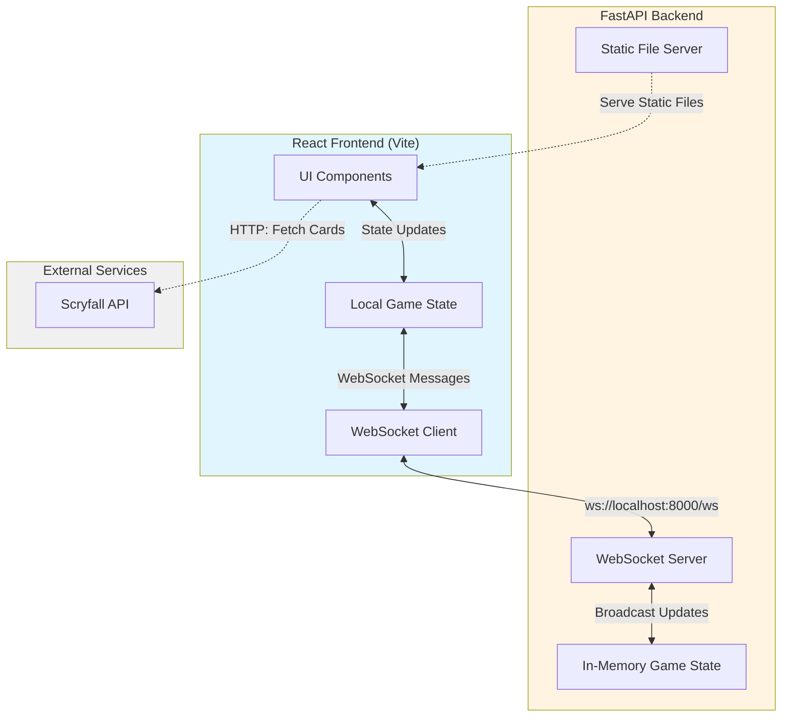
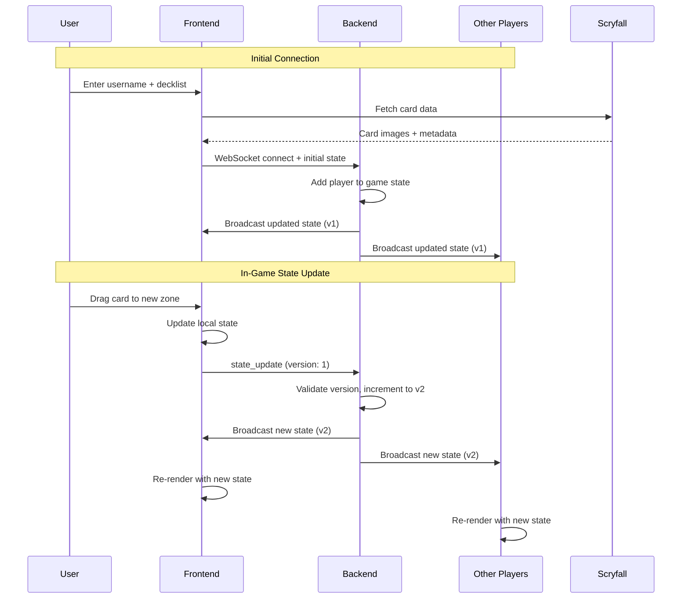

# Fullstack Magic: The Gathering Game

A real-time multiplayer Magic: The Gathering game built with React and FastAPI, featuring WebSocket-based state synchronization.

## Architecture

**Frontend**: React + Vite
**Backend**: Python FastAPI with WebSocket support
**Communication**: WebSocket connections for real-time game state updates

### System Overview

This is a three-tier architecture with a React frontend, FastAPI backend, and Scryfall API integration. The backend maintains an in-memory game state that is synchronized across all connected players using WebSockets. When any player performs an action (drawing a card, moving cards between zones, tapping/untapping), the backend broadcasts the updated state to all clients in real-time.

The system uses version-based optimistic locking to handle concurrent updates—each state change increments a version counter, and clients must send the current version with their updates. This prevents race conditions when multiple players interact simultaneously. Deck data is fetched from the Scryfall API during initial connection, providing card images and metadata.

### Architecture Diagram



### State Synchronization Flow



## Project Structure

```
fullstack/
├── frontend/          # React application
│   ├── src/
│   └── dist/         # Build output (gitignored)
├── backend/          # FastAPI server
│   ├── main.py       # Server entry point
│   ├── dist/         # Production frontend files (gitignored)
│   └── bulk_query.py # Scryfall API utilities
└── deploy.sh         # Production deployment script
```

## Prerequisites

- Node.js and npm
- Python 3.x
- pip (Python package manager)

## Installation

### Frontend Setup
```bash
cd frontend
npm install
```

### Backend Setup
```bash
cd backend
pip install fastapi uvicorn websockets
# Install other dependencies as needed
```

## Development Mode

Development mode runs the frontend and backend as separate servers with hot module reloading.

**Terminal 1** - Frontend dev server:
```bash
cd frontend
npm run dev
```
Runs on `http://localhost:5173` (Vite dev server)

**Terminal 2** - Backend server:
```bash
cd backend
python3 main.py
```
Runs on `http://127.0.0.1:8000` (FastAPI server)

**How it works**:
- Visit the Vite dev server at `http://localhost:5173`
- Frontend connects to backend WebSocket at `ws://localhost:8000/ws/{username}`
- Changes to frontend code auto-reload
- Changes to backend code auto-reload (uvicorn reload mode)

## Production Deployment

Production mode builds the frontend into static files and serves everything from a single backend server.

### Quick Deploy
```bash
./deploy.sh
```

This script:
1. Builds the frontend (`npm run build`)
2. Copies build output to `backend/dist/`
3. Starts the backend server

Visit: `http://localhost:8000`

### Manual Deploy Steps
```bash
# Build frontend
cd frontend
npm run build

# Copy to backend
cp -r dist/* ../backend/dist/

# Run backend
cd ../backend
python3 main.py
```

**How it works**:
- Backend serves static files from `backend/dist/` at the root path
- WebSocket routes at `/ws/{username}` remain available
- Frontend and backend run on the same server (port 8000)

## How the Deployment Works

### Static File Serving

When you build the React app, Vite creates optimized production files:
- `index.html` - Entry point
- `assets/index-[hash].js` - Bundled JavaScript
- `assets/index-[hash].css` - Styles
- Images and other assets

The backend serves these files directly to the browser without modification. Once loaded, the React app runs client-side and connects to the backend's WebSocket for real-time game state.

### Route Priority

FastAPI checks routes in order:
1. WebSocket route `/ws/{username}` - Handled by WebSocket endpoint
2. Everything else `/` - Served from `dist/` folder as static files

This allows the same server to handle both static file delivery and real-time WebSocket connections.

## Features

- **Real-time multiplayer**: State synchronization via WebSocket
- **Deck import**: MTGA-formatted decklists via Scryfall API
- **Card interactions**: Tap/untap, zones (hand, battlefield, graveyard, exile, library)
- **Keyboard shortcuts**: Draw (d), view library (l), scry (s), view graveyard (g), view exile (x)

## Tech Stack

**Frontend**:
- React 18.3
- Vite 6.0 (build tool)
- UUID (card identification)

**Backend**:
- FastAPI 0.109
- Uvicorn (ASGI server)
- WebSockets (real-time communication)

## Development vs Production

| Aspect | Development | Production |
|--------|-------------|------------|
| Frontend Server | Vite dev server (5173) | Backend serves static files |
| Backend Server | FastAPI (8000) | FastAPI (8000) |
| Hot Reload | Yes (both) | No |
| Access | http://localhost:5173 | http://localhost:8000 |
| CORS | Enabled | Enabled |

Both modes use the same WebSocket connection to the backend for game state management.
